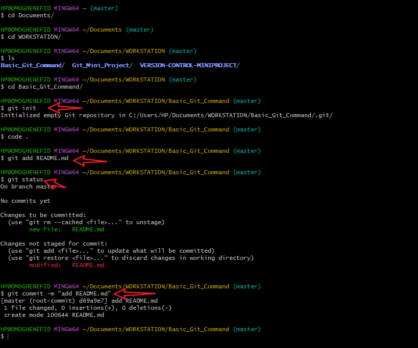
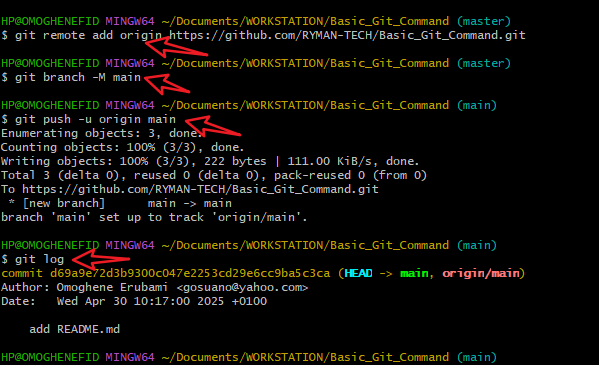
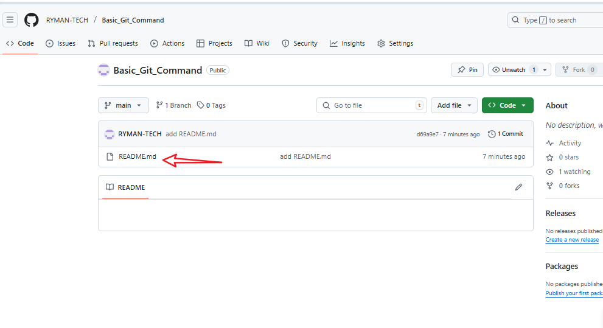

# Basic Git Command

This project introduces beginners to **Git version control** and **Markdown**, essential tools in software development and collaborative writing.  
By crafting a fairytale, learners practice basic Git commands, allowing them to:

- Track changes over time
- Collaborate effectively
- Understand how version control works in real-life projects

the basic commands that will be used in this mini project will be git init, git add, git status, git commit, git branch, and of course git push.

screenshots will be taken to show all the processes and steps taken to complete the mini project.

Below are the screenshots of all process followed in git bash to complete this project.

